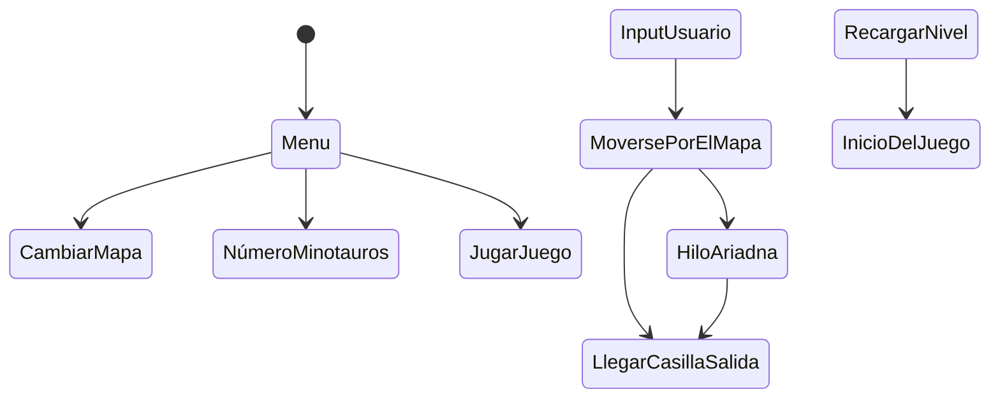

# IAV23-G04-P2

## Autores
- Raul Saavedra de la Riera (<a href=https://github.com/RaulSaavedraRiera> RaulSaavedraRiera</a>)
- Antonio Povedano Ortiz (<a href=https://github.com/AntonioPove> AntonioPove</a>)

## Propuesta
Esta práctica consiste en implementar un pequeño juego en el que controlaremos a Teseo, el cual tendrá que escpar del laberinto evitando a los minotauros que habitan en este. En el juego se implementará inteligebcia artificial tanto en los minotauros como en el propio
El enunciado de esta práctica se encuentra en:
https://narratech.com/es/inteligencia-artificial-para-videojuegos/navegacion/el-secreto-del-laberinto/

El avatar del jugador será **Teseo** el cual podremos controlar con las teclas WASD y con el click izquierdo del botón. Su objetivo es llegar a la plataforma de salida del laberinto. Además, cuando este activo el hilo de Ariadna, Teseo se moverá automaticamente, por la ruta más corta, a la casilla de salida.

Los **minotauros**, cuyo número puede ser variado en la pantalla del menú del juego, estarán merodeando por el laberinto hasta que tengan a Teseo a la vista o se encuentren cerca de él.

Además podremos reiniciar el juego a partir de la tecla 'R', cambiar el número de FPS del juego a través de la tecla 'F' y 'C' patra cambiar la heurísca para cambiarr la
forma de estimado para calcular las rutas posibles.


## Punto de partida
Se parte de un proyecto base de Unity proporcionado por el profesor aquí:
https://github.com/Narratech/IAV-Navegacion/

El prototipo que se nos da consta de una plantilla donde encontramos:

-Una escena de Unity, que contiene:
    - Un menú en el que se puede inicilizar el tamaño del laberinto y el número de minotauros del juego.
    - El personaje del jugador el cual se puede controlar tanto con teclado como con ratón.
    - Un laberinto el cual contiene una casilla inicial la cual será donde se encuentre el jugador al iniciar el juego, y una casilla de salida para poder ganar el juego.
    - Una interfaz de usuario con los atajos rápidos del juego asi como datos para conocer el funcionamiento y rendimiento de este.


Los scripts que se nos proporcionan en dicho proyecto son varios y de diversa índole (muchos de estos scripts han sido ya utilizados en la práctica 1 de esta asignatura, https://github.com/IAV23-G04/IAV23-G04-P1):
 
 **GameManager**
 En primer lugar encontramos el script GameManager que se encarga de controlar el estado del juego y mostrar diversos valores en pantalla. Desde él podemos ajustar el FrameRate, recargar la escena y cambiar el tipo de heurística mostrada. 
 Otro métdodo relevante es el de FindGO() que obtiene los datos relevantes de la escena diferenciando entre menú y laberinto. Por ejemplo el texto de la label en el primero o el avatar en el segundo.
 Como último punto relevante señalar que posee métodos para "generar" la entrada y la salida del laberitno dadas por el GraphGrid del que hablaremos más adelante.

 Tenemos como otr pilar del proyecto los scripts de Graphs, encargadados tanto de la generación del mapa, como del cálculo de costes, su visualización...

Los dos primeros scripts son simples y su función principal es almacenar y comparar información sobre el mapa donde se calcularán las rutas.

**Vertex**
    Script simple que guarda un punto de la ruta. Su id y su coste conforman la información que posee. Permite comparar con objetos y otros vértices así como comparalos para ver cual posee un coste menor.

 **Node**
    Script simple que es usado para almacenar la información de un nodo. Guarda su vertexID, el anterior a este, el coste hasta ahora y el aproximado. Hay métodos de comparació entre nodos y en resumen su infunción es la de almacenar la información de un punto en el "mapa".

Otro grupo de script importante es el de los Grafos. Contienen el mapa a nivel lógico y lo generan en el espacio de juego.

**Graph**
    Es una clase abstracta, por lo que su objetivo es ser usada como base para crear grafos sobre ella.
    Contiene variables que almacenan todos los vértices, sus vértices vecinos, los costes de estos, el tamaño... En definitiva: almacena toda la información del mapa.
    Contiene un métodos virtuales varios para la gestión de los vértices y sus costes, así como para el mapa:
        -Load() para cargar los mapas.
        -UpdateVertexCosts() para actualizar valores de los vértices respecto al mapa.
        -GetNearestVertex() para obtener el vértice más cercano y GetRandomPos() para obtener ua posición aleatoria del mapa.
        -GetNeighbourdsCosts() para obtener los costes de los vecinos desde un vértice.
    A su vez cuenta con métodos para calcular caminos óptimos mediante diferentes algoritmos: BFS, DFS y PathAstar o A*. Para suavizarlos con SMooth() y BuildPath() para reconstruir los caminos realizados.   

**GraphGrid**
    Es una clase que hereda de Graph y como tal cuenta con las funciones que esta  traía consigo.
    Sobreescribe el método Load() y usando diferentes prefabs que posee como variables genera un mapa jugable.
    A su vez en esta función llama a métodos del GameManager para definir la entrada y la salida.
    Crea el método SetNeighbourds para definir los vecinos de cada uno de los vértices durante el métodod Load().
    Crea el método WallInstantiate() para generar aquellas zonas donde no hayas vértices navegables, poniendo muros para crear el laberinto, tanto visualmente como de gameplay, deseado.
    Sobreescribe los métodos GeNearestVertex(), UpdateVertexCost() y GetRandomPos() para que se adapten al mapa establecido.

**TheseusGraph**
    Es un script encargado de calcular y dibujar el camino óptimo de un punto a otro. Pudiendo usar diferentes heurísticas y algoritmos de búsqueda. De base se da por sentado 2 heurísticas y los 3 algoritmos de búsqueda ya comentados.
    Como variables base posee unas que debe da rel desarrollador como el tipo de algoritmo con el que se debe calcular, si hay que suavizar la ruta, los tags de los nodos, color de la ruta y el radio del nodo. Y otras que son tomadas del GameObject como la cámara o el lineRender y otras que pueden variar como la heurística en uso.
    Ariadna es el nombre que se le da al comportamiento donde genera la mejor ruta desde el nodo actual hasta el destino.
    En el Update podemos cambiar si usamos a Ariadna o no y en caso positivo se calcula dicha ruta y se muestra en el mapa.
    En el OnDrawGizmos se dibuja  esferas sobre los puntos de la ruta específicados.
    Posee métodos como GetNextNode(), GetNodeFromScreen() para obtener nodos.
    ShowPathVertices() recalca el camino calculado y DIbujaHilo() muestra el hilo sobre el amap. Siendo ambos métodos relevantes para la visión.

EL siguiente conjunto de scripts relevantes relacionados con IA es el de los comportamientos Agente usando la msima estructura que los vistos en la práctica anterior.
De nuevo los scripts bases para esta estructura son dos:

**Agente**
    Igual al de la práctica anterior, se adjunta comentario:
    Clase que se encarga de la interacción entre la inteligencia artificial desarrollada y el medio "físico" de la escena mediante el movimiento. Contiene referencias al rigidbody, y variables para ajustar la velocidad, velocidad angular... Todos los componentes necesarios para poder desarrollar adecuadamente los movimientos deseados.
    A su vez, como apoyo para el Comportamiento Agente guarda variables para identificar si la combinación de acciones se da por peso o prioridad, y métodos como GetPrioridadDireccion llamados en su LateUpdate para la selección de movimiento.
    Por último, y siguiendo su rol de conexión Comportamiento-Medio tiene métodos auxiliares como LookDirection o OriToVec que ayudan a la hora de obtener direcciones o giros. Métodos que son llamados en Update y FixedUpdate donde se encarga de realziar todas las comprobaciones físicas pertienntes.

**ComportamientoAgente**
    Igual al de la práctica anterior, se adjunta comentario:
    Clase abstracta que sirve como plantilla para la creación de los diferentes comportamientos desarrollados. Tiene referencia a un script Agente para poder repercutir en el movimeinto del jugador y tomar los datos que esta proporciona. A su vez cuenta con una referencia común para los diferentes comportamientos como es un Objetivo.
    Cuenta con métodos para un mayor control de RigidBody y su relación con el mundo de Unity como OriToVector o RadianesAGrados.
    Además de esto solo cabe recalcar que en su Update hace referencia a la forma de ponderación de que dirección tomar dependiendo de peso, prioridad o simple según haya sido marcado en Agente.

Ambos usan como apoyo la siguiente clase para representar las fuerzas y direcciones:

**Direccion**
    Igual al de la práctica anterior, se adjunta comentario:
    script que se utiliza de apoyo para representar la dirección y que en código, sea más sencilla de utilizar.

Otro script alejado de los otros grupos de comportamiento e igual al de la práctica anterior es el de ControlJugador:

**ControlJugador**:
    Es un comportamiento "especial" ya que no es IA. Si no que se encarga de recoger la entrada de teclado y parsearla para que pueda ser procesado por Agente y ComportamientoAgente de manera correcta. Siendo el juagdor el que toma la decisión de hacia que dirección desplazarse.
    Lo más relevante de esta clase es que sobreescribe GetDirection para obtener la dirección mediante la entrada de teclado.

Una vez visto estos scripts base hablaremos de los diferentes scripts que implementan multitud de comportamientos.

**LLegada**
    Su principal función es la de una vez se llegue a una distancia del objetivo se reduzca la fuerza de desplazamiento para poder lograr una llegada a este más pausa y realista en lugar de una instántanea menos realista.
    Contiene un comportamiento Avoidance() para evitar la colisión con objetos cuando se encuentre muy cerca del objetivo aunque no esta usada.

**Merodear**
    Su principal función es obtener una dirección aleatoria y desplazarse en ella durante un tiempo determinado. Cuenta con una función de retroceso en caso de colisión con un obstáculo.

Otro conjunto relevante son los relacionados con el minotauro, indpeendientes de agente u otro grupo, que se encargan de gestionar diferentes eventos con los minotauros o generarlos.

**MinoCollision**
    Script independiente al agente que reinicia el nivel si el minotauro golpea con Teseo.

**MinoEvader**
    Script independiente al agente que se encarga de en caso de obtener un evento trigger con un objeto y, en caso de que este sea el minotauro, rehacer la ruta.

**MinoManager**
    Encargado de generar el número de minotauros en el laberinto y con una posición aleatoria dentro del laberinto.

Otro conjunto de scripts de comportamiento son aquellos relacionados directamente con el jugador además del ControlJugador:

**Slow**
    Se encarga de modificar la velocidad máxima cuando el juagdor se acerce al trigger, al área, del minotauro.

**SeguirCamino**
    Su función es la de, como su nombre indica, seguir un camino. Dado un T nodo sigueinte se desplaza hacia él y tiene una función para setear el Path del TheseusGraph del que obtiene los nodos entendemos.

**Teseo**
    Es el que controla la forma en la que se desplaza el jugador que en este caso hace de Teseo. Permite elegir entre seguir el camino de forma automática o desplazamiento por ej jugador. Tiene referencias tanto a SeguirCamino como a ControlJugador para activarlos/desactivarlos.

Estos serían relacionados con la inteligencia artificial y el mapa. Ahora hablaremos de otros scripts auxiliares como los de animación y los extras:

**AnimalAnimationController**
Encargado de controlar y cambiar el estado de la animación del jugador (está moviendose o esta quieto) dependiendo de la velocidad que tenga este en cada momento. 

**CameraFollow**
Encargado de que la cámara tenga siempre el jugador en el centro de esta, y también se encarga de las diferentes interacciones que podemos realizar en esta, asi como aplicar un zoom.

**PlayerAnimation**
Encargado de ajustar la velocidad del jugador para que el animator pueda usarla correctamente.

**BinaryHeap**
Encargado de implemnetar el montículo binario para poder utilizarlo en la práctica ya que Unity no tiene uno implementado de base.

**DropDown**
Encargado de pasar y cambiar los datos de creación de escenario (tamaño) y el número de minotauros que se quieren establecer en cada nivel.

Tenemos la estrcutura base del proyecto como en la práctica anterior pero con muchos scripts, los relacionados al comportamiento, incompletos; que deberemos de completar junto a aquellos que añadamos nosotros mismo para lograr lso objetivos propuestos para esta práctica.

## Diseño de la solución

Lo que vamos a realizar para resolver esta práctica es implementar los diferentes comportamientos explicados anteriormente para los diferentes elementos del juego.
Para los algoritmos que implementaremos nos basaremos en los pseudocódigo de Millington.

El pseudocódigo del algoritmo para calcular los caminos más obtimo, utilizaaremos el algoritmo A*:
```
   function pathfindaAStar(graph: Graph,
                        start: Node,
                        end: Node,
                        heuristic: Heuristic
                        ) -> Connection[]:

    # This structure is used to keep track of the
    # information we need for each node.
    class NodeRecord:
        node: Node
        connection: Connection
        costSoFar: float
        estimatedTotalCost: float

    # Initialize the record for the start node.
    startRecord = new NodeRecord( )
    startRecord.node = start
    startRecord.connection = null
    startRecord.costSoFar = 0
    startRecord.estimatedTotalCost = heuristic.estimate(start)

    # Initialize the open and closed lists.
    open = new PathfindingList()
    open += startkecord
    closed = new PathfindingList()

    # Iterate through processing each node.
    while length(open) > 0:
        # Find the smallest element in the open list (using the
        # estimatedTotalCost). 
        current = open. smallestElement()

        # If it ts the goal node, then terminate.
        if current.node == goal:
            break

        # Otherwise get Lts outgoing connections.
        connections = graph.getConnections( current)

        # Loop through each connection in turn.
        for connection tn connections:
            # Get the cost estimate for the end node.
            endNode = connection. getToNode()
            endNodeCost = current.costSoFar + connection.getCost()

            # If the node is closed we may have to skip, or remove Lt
            # from the closed list.

            if closed.contains(endNode):
                # Here we find the record in the closed list
                # corresponding to the endNode.
                endNodeRecord = closed.find(endNode)

                # If we didn't find a shorter route, skip.
                if endNodeRecord.costSoFar <= endNodeCost:
                    continue

                # Otherwise remove it from the closed list.
                closed -= endNodeRecord

                # We can use the node's old cost values to calculate
                # its heuristic without calling the possibly expensive
                # heuristic function.
                endNodeHeuristic = endNodeRecord.estimatedTotalCost -
                                    endNodeRecord.costSoFar

            # Skip if the node is open and we've not found a better
            # route.

            else if open.contains(endNode):
                # Here we find the record in the open list
                # corresponding to the endNode.

                endNodeRecord = open.find(endNode)
                # If our route is no better, then skip.
                if endNodeRecord.costSoFar <= endNodeCost:
                    continue

                # Again, we can calculate its heuristic.
                endNodeHeuristic = endNodeRecord.cost -
                               endNodeRecord.costSoFar

            # Otherwise we know we've got an unvisited node, so make a
            # record for it.
            else:
                endNodeRecord = new NodeRecord()
                endNodeRecord.node = endNode

                # We'll need to calculate the heurístic value using
                # the function, since we don't have an existing record
                # to use.
                endNodeHeuristic = heuristic.estimate(endNode)

            # We're here if we need to update the node. Update the
            # cost, estimate and connection.
            endNodeRecord.cost = endNodeCost
            endNodeRecord.connection = connection   
            endNodeRecord.estimatedTotalCost = endNodeCost +
                        endNodeHeurístic

            # And add it to the open List.
            If not open.contains(endiode):
                open += endNodeRecord

        # We've finished Looking at the connections for the current
        # node, so add it to the closed List and remove it from the
        # open List.
        open -= current
        closed += current

    # We're here Lf we've etther found the goal, or Lf we've no more
    # nodes to search, find mich,
    if current.node != goal:
        # We've run out of nodes without finding the goal, so there's
        #  no solution.
        return null
    else:
        # Compile the List of connections in the path.
        path = []

        # Work back along the path, accumulating connections,
        while current.node != start:
            path += current.connection
            current = current.connectton.getFromNode()

        # Reverse the path, and return tt.
        return reverse(path)
```
El pseudocódigo del algoritmo de Smooth es:

```
    Smooth(inputPath: Vertex List) -> Vertex List:
    result = new Vertex List

    result.add(inputPath[0])
    inpuxIndex = 2

    from = result[-1].position
    to = inputPath[inpuxIndex].position
    direction = (to - from).normalize()
    distancie = distancie_between_vertex(from, to)
    raycast_hit = ThrowRay(from, direction, distanci3, ~LayerMask.NameToLayer("Ground"))
    
    if(raycast_hit && raycast_hit.collider.gameObject.layer != LayerMask.NameToLayer("Ground"))
        result.add(inputPath[inpuxIndex - 1])
        
    inpuxIndex++
    result.add(inputPath[-1])
    return result
```
El pseudocódigo del algoritmo de seguimiento es:

```
class KinematicSeek:
character: Static
target: Static

maxSpeed: float

function getSteeringl -> KinematicSteering0utput:
    result = new KinematicSteering0utput( )

    #Get the direction to the target.
    result.velocity = target.position - character.position

    #The velocity is along this direction, at full speed.
    result .velocity.normalize( )
    result.velocity *= maxSpeed

    #Face in the direction we want to move.
    character.orientation = newOrientation(
    character .orientation,
    result,velocity)

result.rotation = 0 
return result
```

El pseudocódigo del algoritmo de merodeo es:

```
class Kinematiciander:
character: Static
maxSpeed: float

# The maximum rotation speed we"d like, probably should be smaller
# than the maximum possible, for a letsurely change in direction.
maxRotation: float

function getSteering() -> KinematicSteer ingOutput:
    result = new KinematicSteer ing0utput( )

    #Get velocity from the vector form of the orientation.
    result.velocity = maxSpeed * character .orientation.asVector( )

    #Change our orientation randomly.
    result.rotation = randomBinonial() * maxRotation

    return result
```

El diagrama para el jugador sería:



Estos diagramas pueden ser modificados a posteriori en caso de necesitar alguna actualización o que añadamos un comportamiento extra.

## Pruebas y métricas

Aquí se podrán los diferentes videos de las pruebas y partes del proyecto para ir documentando su funcionalidad:

- https://www.youtube.com/watch?v=m7o5ZoqCEWc&ab_channel=AntonioPovedano

## Ampliaciones

    - Los minotauros pierden de vista al jugador cuando este se encuentre detrás de un muro.
    - Mejorados los algoritmos de merodeo y llegada de los minotauros.
    - Indentificador para saber la posición exacta del jugador.

## Producción

Las tareas se han realizado y el esfuerzo ha sido repartido entre los autores.

| Estado  |  Tarea  |  Persona  |  
|:-:|:--|:-:|
| ✔ | Readme explicacion de clases | Raul |
| ✔ | Impletación del algoritmo A* | Raul |
| ✔ | Movimiento por ratón del jugador | Raul |
| ✔ | Modificación del peso en las casillas cercanas al minotauro | Raul |
| ✔ | Heurística Heuclídea | Raul |
| ✔ | Readme propuesta, punto de partida, pseudocodigo | Antonio |
| ✔ | Implementación del algoritmo Smooth | Antonio |
| ✔ | Uso correcto del hilo de Ariadna | Antonio |
| ✔ | Heurística Manhattan | Antonio |
| OPCIONAL|
| ✔ | Puntero del ratón para saber la posición exacta del jugador | Raul |
| ✔ | Implementación mejorada del merodeo y llegada el minotauro | Antonio |
| ✔ | Perder de vista al jugador | Antonio |


Todo se ha hecho junto ya que residimos en la misma vivienda


## Referencias

Los recursos de terceros utilizados son de uso público.

- *AI for Games*, Ian Millington. Hemos obtenido de aqui los pseudocódigos que se van a usar para implementar estar práctica.
- Diapositivas sacadas de la página: https://narratech.com/es/category/sector_es/informatica/
- [Kaykit Medieval Builder Pack](https://kaylousberg.itch.io/kaykit-medieval-builder-pack)
- [Kaykit Dungeon](https://kaylousberg.itch.io/kaykit-dungeon)
- [Kaykit Animations](https://kaylousberg.itch.io/kaykit-animations)

