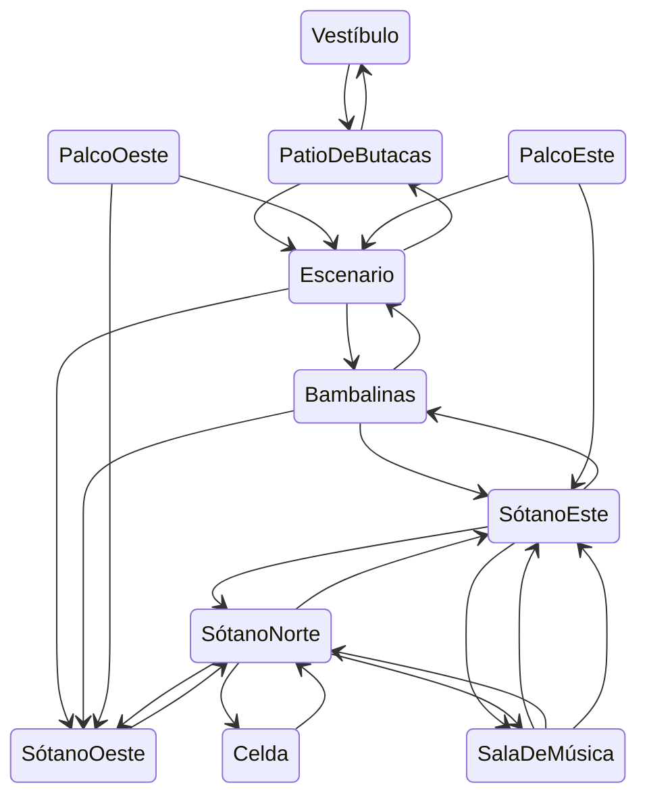
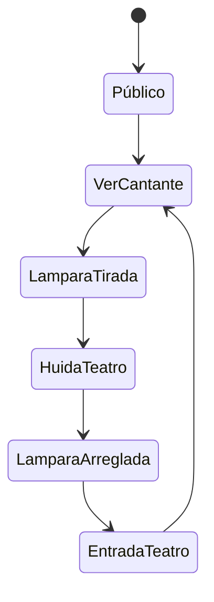
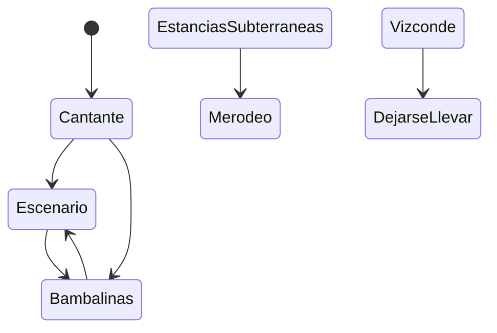
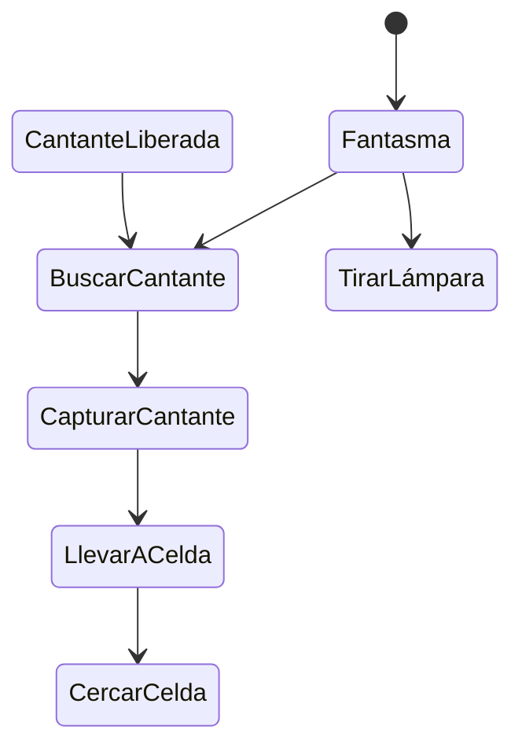

# IAV23-G04-P2

## Autores
- Raul Saavedra de la Riera (<a href=https://github.com/RaulSaavedraRiera> RaulSaavedraRiera</a>)
- Antonio Povedano Ortiz (<a href=https://github.com/AntonioPove> AntonioPove</a>)

## Propuesta
Esta práctica consiste en implementar un pequeño juego en el que controlaremos al vizconde, el cual se podrá mover por un pequeño teatro intentando salvar a la cantanate cuando esta sea secuestrada por el fantasma, además otras muchas más acciones que pueden ser realizadas por los diferentes personajes del juego.
El enunciado de esta práctica se encuentra en:
https://narratech.com/es/inteligencia-artificial-para-videojuegos/decision/historias-de-fantasmas/

El avatar del jugador será el **vizconde** el cual podremos controlar con el click izquierdo del ratón. Su objetivo será rescatar a la cantante si esta es encarcelada por el *fantasma* en algún momento. Además podrá arreglar la lámpara si alguna vez esta ha sido tirada por el *fantasma*.

El **fantasma** alternará entre acciones, entre las que se encuentrar el tirar la lámpara secuestrar a la cantante, encarcelarla, cerrar la rejas, etc.

La **cantante** alternara entre acciones al igual que el *fantasma*, entre estas acciones encontramos la de cantar en el escenario merodear por el mapa de manera "desorientada" y dejarse coger por diferentes personajes.

El **público** se encuentra justo delante del escenerio. Si en algún momento las lámparas se caen, todos los espectadores huirán fuera del teatro hasta que la lámpara vuelva ser colocada.

Además podremos cambiar la vista de la cámara a partir de los números 1, 2, 3 o 4, golpear a partir del espacio, usar Q para capturar a la *cantante*  y la E para interactuar con el elementos del escenario (palancas).

Otro punto relevante son las diferentes zonas que encontraremos en el mapa. Siendo el edificio donde se desarrolla la acción otro personaje principal con multitud de zonas y caminos que las conectan. Encontramos principalmente las siguientes:

**Patio de butacas**: divido en este y oeste, cada parte tiene a su público que reaccionará al fantasma y huirá si cae la lámpara y se apaga la luz de su zona. Esta conectada con el *escenario* y el *vestibulo*. Se puede ver desde los *palcos* pero no a la inversa.

**Vestíbulo**: Una zona amplia donde se refugia el públic cuando se austa, únicamente conecta con el *patio de butacas*.

**Escenario**: lugar inicial de la *cantante* donde actúa y conectada a *Bambalinas* para los descansos de ella. Una trampilla permite bajar al *sótano oeste* pero no regresar.

**Bambalinas**: donde descansa la *cantante* y conectada directamente con el *sótano este* y el *escenario*. Una rampa en ella permite bajar al *sótano oeste* pero no regresar.

**Palco oeste**: estancia inicial del vizconde donde se encuentra la palanca con la que lanzar la lámpara del patio de *butacas oeste*. Conectada directamente con el *escenario* y el *sótano oeste*; desde ella se puede ver el *patio de butacas* pero no a la inversa.

**Palco este**: sala similar a la anterior pero cambiando la zona oeste de las habitaciones conectadas por la este.

**Sótano oeste**: estancia conectada con el *palco oeste*, *bambalinas* y su homológo norte. Esta última requiere de subirse de una barca que comienza en la orilla contraria.

**Sótano este**: estancia conectada con el *palco este*, su homóloga norte, y la *sala de música*; conectando estas dos últimas a través de barcas. La primera conexión tiene la barca en esta orilla al incio, la segunda en la contraria.

**Celda**: sala que conecta con el *sótano norte* y donde el *fantasma* debe dejar a la *cantante* para completar su secuestro. Cuenta con unas rejas activables/desactibables que encierran a la *cantante*.

**Sótano norte**: estancia que conecta con la celda y a través de barcas con la *sala de música*, el *sótano este* y el *sótano oeste*.

**Sala de música**: estancia inicial del *fantasma*, donde compone. Mediante barcas conecta con *sótano norte* y *sótano este*. 

Además de estas salas hay que tener en cuenta respecto al mapa una serie de datos:

- Todos los lugares conectados por barcas cuentan con palancas a ambos lados para traer las barcas a este, con un coste mayor.

- Las palancas son interactuables tanto por el *fantasma* como por le *vizconde*.

- Las barcas solo pueden ser ocupadas por una persona, o dos personas si una de las dos lleva la otra al hombro(*fantasma* y *cantante*).

- Los golpes dados a muebles como el piano en la sal de música se escucharán en todas las estancias subterráneas.


Por último hay que tener en cuenta una serie de comportamientos tanto del propio escenario como de los mismos personajes:

- El público chillará si ve al fantasma sobre escenario.
- El fantasma no capturará a la cantante si hay público mirando.
- Si el vizconde toca al fantasma con la chica capturada, este la soltará.
- Si el vizconde choca con el fantasma hará que retroceda.
- El vizconde puede arreglar la lámpara interactuando con ella.
- El fantasma querrá secuestrar a la cantante cuando la oiga cantar.
- El fantasma abortará cualquier acción que este haciendo si escucha al vizconde tocar su piano.
- Solo se podrá pasar entre los rios si la barca está en esa parte de la orilla.

## Punto de partida
Se parte de un proyecto base de Unity proporcionado por el profesor aquí:
https://github.com/Narratech/IAV-Decision

El prototipo que se nos da consta de una plantilla donde encontramos:

-Una escena de Unity, que contiene:
    - Un mapa de juego formado por diferentes habitaciones y caminos.
    - Diferenetes elementos con los que interactuar a través del personaje (barca, palancas, etc.).
    - El personaje del jugador que se puede controlar a través del ratón.
    - Un público que se encuentra delante del escenario.
    - La cantante, fantasma y piano aún sin ningún tipo de función.


Los scripts que se nos proporcionan en dicho proyecto son varios y de diversa índole (muchos de estos scripts han sido ya utilizados en la práctica 1 de esta asignatura, https://github.com/IAV23-G04/IAV23-G04-P1):

El primer grupo de scripts que tenemos que observar son aquellos relacionados con la gestión del mundo y el estado en el que se encuentra; encontramos los siguientes:

**GameBlackBoard**
Permite obtener a los demás scripts toda la información del mundo que necesitán. Es una forma de consultor para conocer el estado del mundo en todo momento. Guarda referencia a las habitaciones, el jugador y la cantante, las palancas, etc. 
Permite obtener una posición aleatoria de una lista dada y consultar si la cantante esta capturada, el fantasma está en el sótano y otras variables relacioandas con la dinámica de la partida.

**SotanosTrigger**
Gestiona la entrada y salida del fantasma con los sótanos. Tiene referencia al fantasma para saber si es él y al blackboard para comunicar la actualización de estado.

Algunos de ellos además de actualizar el estado del mundo también realizan acciones sobre el propio mundo del juego:

**PalancaPuerta**
Guarda referencia al BlackBoard anterior y a la puerta correspondiente. Solo interactúa con el fantasma y al ejecutar dicho método abre o cierra la puerta que se encuentra en el mismo gameObject que si mismo.

**Barca**
Se encarga de desplazar la barca de manera kinemática de un punto a otro. Cuenta con métodos para añadir un pasajero y fijar un origen, como para fijar un destino. Una vez llegado al destino si hay pasajero reactiva el desplazamiento del jugador para que pueda reanudar su ruta.

**BarcaTrigger**
Es el encargado de controlar el uso de la barca mediante el disparador Trigger. Contiene referencias al jugador, la barca, el fantasma, y el sato; relacionados con este último posee métodos para ajustar los costes de los saltos de navmesh para modificar el coste del camino recorrido por la barca asociada. A su vez cuenta con costes de espera y enfriamiento de la barca para ajustar su uso a elección.

**ControlPalanca**
Gestiona una palanca. Posee referencia a un candelabro y un público sobre los que tiene influencia. Su método Interact se genera cuando el fantasma desencadena un Trigger con ella. 
Si el candelabro estaba caído este subirá y se encenderá la luz de nuevo; en caso contrario, caerá y apagará la luz del público objetivo.

**ControlPiano**
Gestiona el piano. Tiene referencia al fantasma, a los diferentes sonidos que debe reproducir. A su vez cuenta con variables de estado(tocado, roto, tocadoDaOtro) y para definir el númerto de toques actual y máximo.
Su interacción y reparácion por parte del fantasma se lanza desde otros scripts. Permiten desde reproducir la música del fantasma a reparar el piano y dejarlo en el estado por defecto. 
Con un evento Trigger se dispara InteractVizconde ya sea el jugador, o la cantante el que interáctue con él, que reproduce un sonido y en caso de alcanzar el máximo número de toques lo rompe. 

Un segundo grupo serían aquellos que sirven para que el mundo dado se muestre adecuadamente, y con el feedback correcto, al jugador:

**FollowClick**
Dado un offset y un objetivo transporta al portador a la posición del objetivo más el offset de manera continua.

**WayMark**
Oculta la retóicula al llegar el jugador a laposición de esta.

**CameraManager**
Encargado de controlar toda la lógica tras las cámaras que tenemos en la escena. Contiene referencias a las 4 cámaras principales: la main, la del fantasma, la cantante y la general. Permite cambiar mediante teclas de cámara activa e inicia la partida con la cámara main activa.

**SiguePersonaje**
Script que se encarga de seguir a un personaje, en esta práctica es asociado a las cámaras. Guarda referencia al target, obstáculos entre el personaje a seguir y si mismo(se actualzia con el tiempo), y variables técnicas de rotación o ángulo de la orbita.
Actualiza constantemente que obstáculos debe hacer invisible para poder mantener al personaje en cámara así como la posición y la visión. Por último implementa rotaciones manuales en caso de que el jugador quiera rotar la cámara.

Por último tendríamos el grupo de código más grande que es aquel relacionado con la IA de los diferentes personajes que encontramos en el mundo:

Cuenta con unos pocos scripts auxiliares :

**Agente**
Visto en las anteriores prácticas. Link arriba para más información.

**Direccion**
Visto en las anteriores prácticas. Link arriba para más información.

Y aquellos para cada uno de los personajes:

Uno general para cada personaje del público:

**Publico**
Gestiona una unidad de "publico". Contiene variables para saber si esta sentado y si la luz esta encendida. Tiene métodos para que sepa que se ha apagado o encendido su luz asociada y, por consiguiente, si esta de pié o sentado debido a esta. 
A tiempo real, gestiona que mire hacia donde se desplaza si la luz esta apagada, y si esta encendida y por tanto atento a la función, mire hacia delante(el escenario).

Dos para el jugador:

**JugadorAgente**
Hereda de la clase ya vista agente. Cuenta con una referencia al rigidbody sobre el que aplicar fuerza.
Obtiene una dirección en el Update de los ejes y la ajusta a la velocidad máxima y en el fixedUpdate desplaza el cuerpo, ya sea mediante el rigidBody o de forma kinemática si no lo posee en la velocidad calculada anteriormente.
**Player**
Gestiona, en la implementación que se nos proporciona de base, los ataques y la acción de captura del jugador. Contiene referencias a las aréas de ataque, acción y captura; junto a múltiples variables para editar los tiempos de las diferentes partes relacionadas con el ataque.
Toda su lógica se desarrolla en el Update, cuenta con if que se ejecutan para controlar coldowns y tiempos y otros relacionados con la pulsación de teclas por parte del jugador; entre ellos encontramos la de capturar o la de atacar.

Uno para la cantante:

**Cantante**
Da el comportamiento lógico a la cantante. Cuenta con múltiples variables para ajustar sus tiempos de canto, de descanso, etc; para ajustar sus rútinas y otros más mecánicos como el campo de visión, la distancia de vista o el objetivo al que observar.
Cuenta con múltiples métodos para realizar las diferentes acciones que puede realizar como Cantar/TerminarDeCantar, Descansar/TermianrDeDescansar, etc. Con métodos para conocer el estado actual del personaje: ConozcoSitio, EstaEnCelda, EstaCapturada.
Por último cuenta con métodos para realizar acciones respecto a otros personajes: SeguirAlVizconde, SeguirAlFantasma, MirarAlVizconde, CambiarObjetivo; son algunos de ellos.

Y múltiples para el fantasma, que presenta el comportamiento más complejo, divididos en dos grupos.

Unos que heredan de acción y se encarga de realizar la acción, usando como base el siguiente script.

**Accion**
Se utiliza para disparar acciones al desencadenar un efecto Trigger entre el fantasma y palancas, el piano o las puertas. Debe equiparse al portador. Usada como base para los siguientes.

Y que se amplía para generar los sigueintes comportamientos:

**GhostArreglaPianoAction**  
    Script que hereda de action, se encarga de realizar la acción de arreglar el piano y devuelve si esta acción se esta realizando o no.

**GhostChaseAction**
    Script que hereda de action, se encarga de hacer que el personaje del fantasma siga a la cantante para poder capturarla. Además devuelve si esta acción se está realizando o no. 

**GhostCloseDoorAction**
    Script que hereda de action, encargado de cambiar la posicion de la puerta (cerrarla y abrirla), cuando el personaje del fantasma interactue con esta.

**GhostLlevarCantante**
    Script que hereda de action, encargado de hacer que el fantasma capture a la cantante. Comprueba la posición de ambos para ver si la acción puede ser realizada o no, y hace que la cantante se mueva a la misma vez que el fantasma. 

**GhostReturnAction**
    Script que hereda de action, encargado de hacer que el fantasma vuelva a la sala de música y devuelve si la aciión ha sido completada con éxito.
    
**GhostSearchRandomAction**
    Script que hereda de action, encargado de hacer que el fantasma vuelva se mueva a salas aleatorias del mapa a partir de la asignación de GameBlackBoard, y cuando el fantasma esté en esta nueva ubicación devolverá si la acción ha sido realizada con éxito.

**GhostSearchStageAction**
    Script que hereda de action, encargado de hacer que el fantasma vaya al escenario y devolverá si la acción ha sido realizada con éxito.
 
Y aquellos que hacen de condiciones y se usan para comprobar el uso de las acciones anteriormente nombradas:

**CantanteCondition**
    Script que hereda de conditional, encargado de comprobar si la acción de la cantante, en este caso que se encuentre cantando, se haya realizado de manera correcta o por si el contrario esta acción ha sido un fallo.

**CapturadaCondition**
    Script que hereda de conditional, encargado de comprobar si la acción de capturar a la cantante ha sido realizada con éxito o no. Además es el encargado de realizar esta misma acción.

**PianoCondition**
    Script que hereda de conditional, encargado de comprobar si el piano está siendo tocado por el fantasma o no.

**PublicoCondition**
    Script que hereda de conditional, encargado de comprobar ambas partes del público (este y oeste) y de comprobar las acciones que estos están realizando.

**VizcondeChocaCondition**
    Script que hereda de conditional, encargado de comprobar las acciones del vizconde cuando la cantante se encuentra en el palco.

**ImprisonedCondition**
    Script que hereda de conditional, encargado de comprobar si la acción de la cantante, en este caso que se encuentre encarcelada, se haya realizado de manera correcta o por si el contrario esta acción ha sido un fallo.


Por último, dentro de esta misma categoría, tenemos una serie de scripts que hacen de condiciones 


**ImprisonedCondition**
    Script que hereda de conditional, encargado de comprobar si la acción de la cantante, en este caso que se encuentre encarcelada, se haya realizado de manera correcta o por si el contrario esta acción ha sido un fallo.

**PianoCondition**
    Script que hereda de conditional, encargado de comprobar si el piano está siendo tocado por el fantasma o no.

**PublicoCondition**
    Script que hereda de conditional, encargado de comprobar ambas partes del público (este y oeste) y de comprobar las acciones que estos están realizando.

**VizcondeChocaCondition**
    Script que hereda de conditional, encargado de comprobar las acciones del vizconde cuando la cantante se encuentra en el palco.

## Diseño de la solución

Lo que vamos a realizar para resolver esta práctica es implementar los diferentes comportamientos explicados anteriormente para los diferentes elementos del juego.
Para los algoritmos que implementaremos nos basaremos en los pseudocódigo de Millington.
Para la clase de Action se utilizará de la siguiente manera:

```
    class Action:
        function getGoalChange(goal: float) -> float
        function getDuration() -> float
```

El público tendrá el siguiente comportamiento:



La máquina de estados utilizada para la cantante se escruturará de la siguiente manera:



El árbol de comportamiento del fantasma será de la siguiente manera:


Además el fantasma contará con con un sistema de gestión sensorial para reaccionar a lo que realmente ve y oye, únicamente recordando lo que ha ido viendo por el mundo.


## Pruebas y métricas

Aquí se podrán los diferentes videos de las pruebas y partes del proyecto para ir documentando su funcionalidad:

## Ampliaciones

    Pondremos las modificaciones externas a la práctica cuando estas sean realizadas

## Producción

Las tareas se han realizado y el esfuerzo ha sido repartido entre los autores.

| Estado  |  Tarea  |  Persona  |  
|:-:|:--|:-:|
| ✔ | Readme explicacion de clases y explicación del escenario | Raul |
| ✔ | Readme explicacion de clases y propuesta | Antonio |
| OPCIONAL|

Todo se ha hecho junto ya que residimos en la misma vivienda


## Referencias

Los recursos de terceros utilizados son de uso público.

- *AI for Games*, Ian Millington. Hemos obtenido de aqui los pseudocódigos que se van a usar para implementar estar práctica.
- Diapositivas sacadas de la página: https://narratech.com/es/category/sector_es/informatica/
- [Kaykit Medieval Builder Pack](https://kaylousberg.itch.io/kaykit-medieval-builder-pack)
- [Kaykit Dungeon](https://kaylousberg.itch.io/kaykit-dungeon)
- [Kaykit Animations](https://kaylousberg.itch.io/kaykit-animations)

